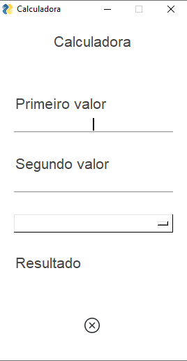
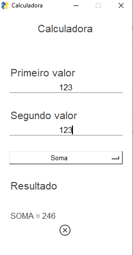
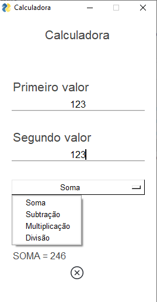

# Projeto Mini-Calculo

<!---Esses são exemplos. Veja https:/shields.io para outras pessoas ou para personalizar este conjunto de escudos. Você pode querer incluir dependências, status do projeto e informações de licença aqui--->

Arquivo referente ao projeto de uma calculadora simples com interface gráfica, e codificação em Python. 

### Tela sistema

